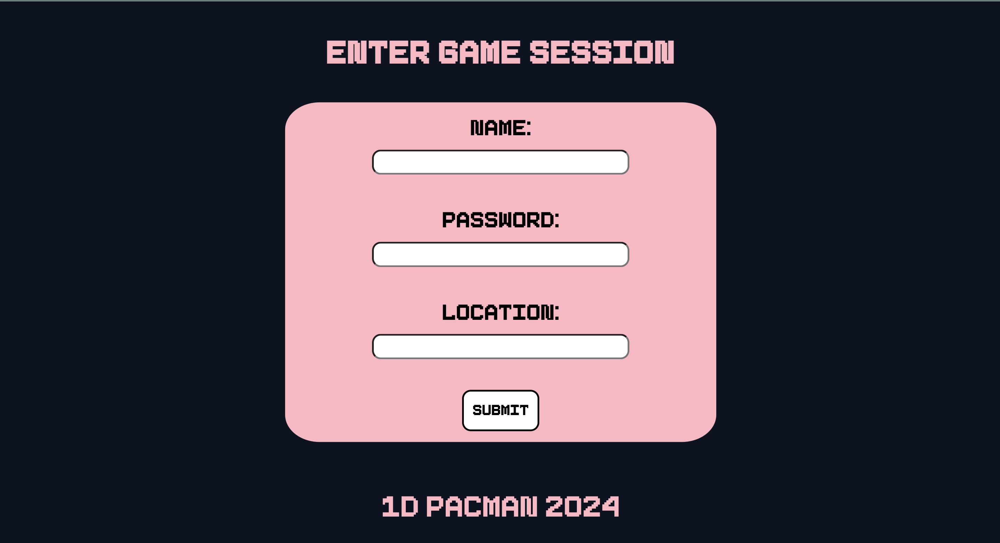
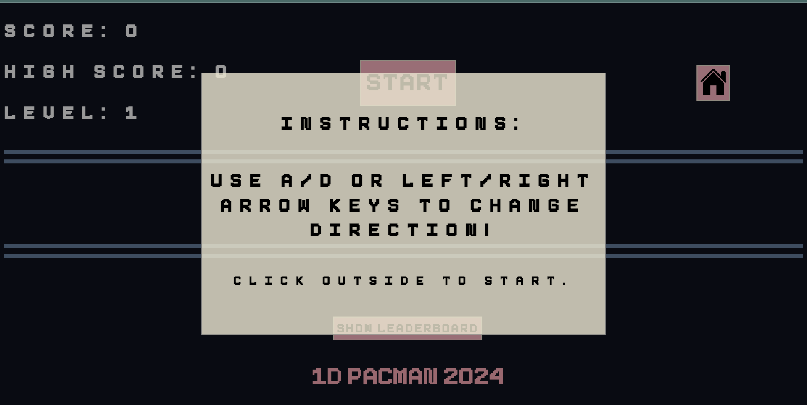
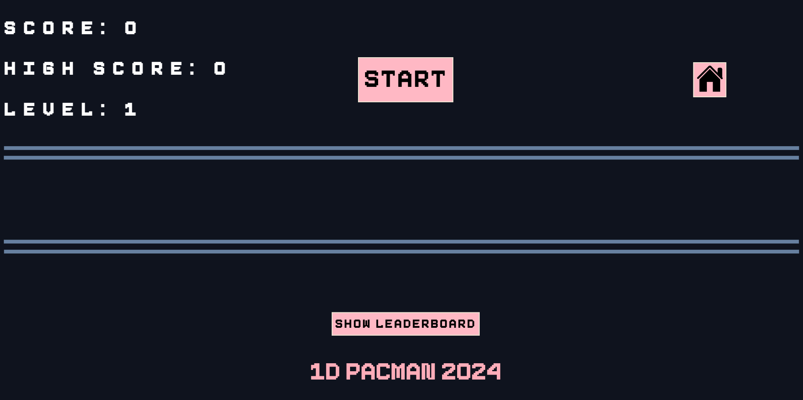
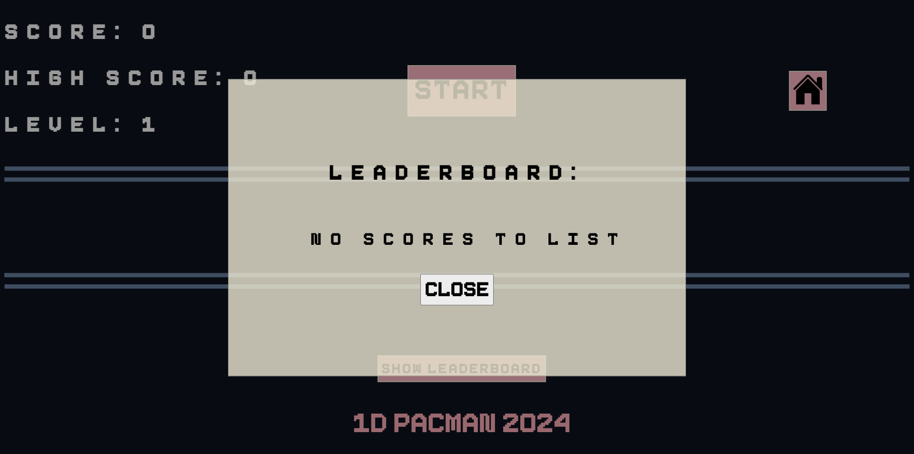
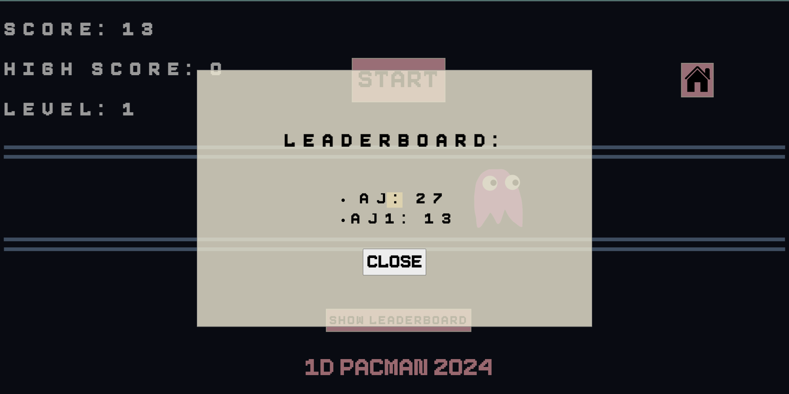

# 1D Pacman Game
Amy Huang (300240777) & Anoushka Jawale (300233148)

## How to Run - Requirements and Steps and Error Management
### Requirements for Running Application 
- Must have MySQL (and know your root user password) and be able to start the server. 
- Must have PHP (any version 8.2) with the MySQLi extension. The MySQLi Extension (MySQL Improved) is a relational database driver used in the PHP scripting language to provide an interface with MySQL databases. 
### Setting up MySQLi on Mac and Windows
- Locate the php.ini file and uncomment "extension=mysqli"
#### On Windows: 
- Ensure that the PHP installation folder is in the correct path (e.g. "C:PHP"); otherwise, you may receive a file path error

### Steps to Run Project
- Change the config file credentials ("3140_A4_Pacman/config/_config.php") to YOUR MySQL login info. If you are already in your root user, you will likely only need to change the password. 

- Start the MySQL server.
- From this directory ("3140_A4_Pacman"), ensure you are on branch main, and run the "php -S localhost:4000 -t public" command in Git Bash/terminal to start the local PHP server. 
- In Chrome, visit "http://localhost:4000/" to find the webpage. 


### Error Management 
- If you get MySQLi error starting with the following: 
``` 
Fatal error: Uncaught mysqli_sql_exception: Unknown database 'pacman'...
```
You are probably running the wrong PHP version. Please see the Requirements section above for the correct version. 

- If you get an access denied error starting with the following: 
``` 
Fatal error: Uncaught mysqli_sql_exception: Access denied for user 'root'@'localhost' (using password: YES)...
```
This error comes about when your login information in _config.php under the 'Variable Declaration' comment is wrong. 

## Overview
Pacman is a classic game in which a Pacman character tries to gain as many points as possible while avoiding the ghost. This project implements 1D Pacman in PHP, JavaScript, HTML, CSS, and SQL database management.

## Login as Player vs. Admin 
- To log in as a player, enter any username, password, and location. These will be your credentials for the whole session unless you visit the home page and sign in again. The user info is stored in the Pacman database and is used to display the username and high score for that user on the leaderboard. The top ten highest scores will be listed.
- To log in as admin, use the following: 
``` 
Username: admin
Password: adminpassword
Location: adminoffice
```
The admin is able to clear the leaderboard, which goes to the backend to clear the leaderboard info in the database so that when you sign in as a user again and select 'Show Leaderboard,' it will say there are no scores to list. 


## How to Play
1. **Start the Game:** Once you have read the instructions, click outside the modal to enter the game board. Click the "Start" button to begin the game.
2. **Avoid the ghost and eat the pellets:** Avoid the ghost by switching directions according to the instructions. You can advance in levels if you continue beating the ghost.
3. **Game Over:** The game ends when your Pacman bumps into the ghost. A restart modal will appear. Click the "Restart" button to start from level 1.

## User Interface
The game interface is designed to be user-friendly. Below are screenshots of various states of the game interface.

### Screenshots

#### Sign In 


#### Main Menu


#### Initial Game State


#### Playing the game


#### Game Over!


### Checking the leaderboard



## Visual Design System
Can be found in the design_system folder, along with the assets used.
