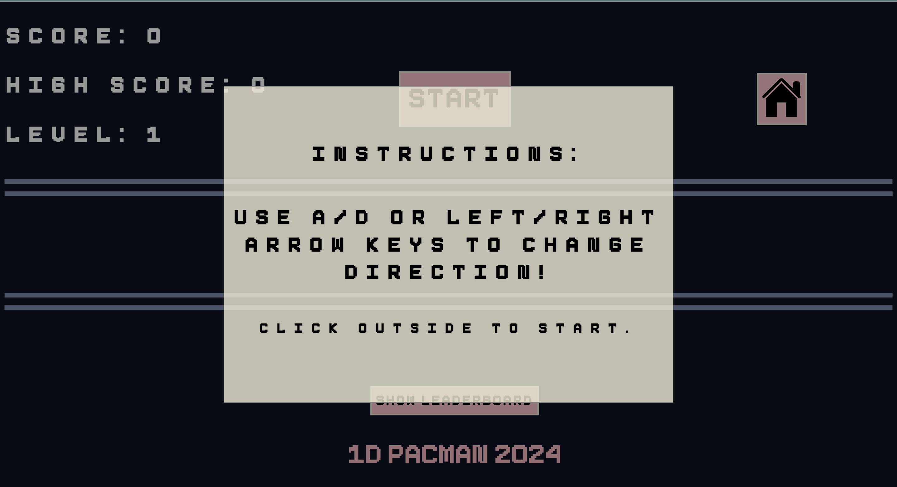

# Pacman Game Design System

This document outlines the visual design system for the 1D Pacman game we created for CSI 3140 Assignment 2.
It includes the structural components, colour palette, and font styles used throughout the game.

## Structural Components
- **Header**: Located at the top of the screen, it contains the scoreboard, which displays the current score, high score, and current level, as well as the start button. 
  
- **Initial Instruction Menu**: The initial menu displays as an overlay modal that explains the game controls and how to start the game.
  
- **Play Area**: The middle area of the game board is the main area where the game is played. It displays Pacman, the ghost, the pellets, and the fruit.
  
- **Leaderboard**: The modal that displays the top 10 scores.
  
- **Restart Menu**: This overlay modal appears when the game is over and contains a restart button.
  
- **Footer**: Located at the bottom, it includes the name of game.
  
- **Leaderboard**: This modal shows the top 10 high scores and opens/closes based on click events.
  

## Colour Palette
- **Primary Colour**: #0D1321 (Dark Blue) — Used for the background colour of the game board body.
- **Secondary Colour**: rgb(240, 235, 216, 0.8) (Beige) — Used for the backgrounds of the initial instruction menu, the restart menu, and the leaderboard menu.
- **Accent Colour**: Lightpink — Used for the background colour of the hover effect for the start/leaderboard buttons and the colour of the footer.
- **Text Colour**: White — Used for the colour of the score board display in the header. // Black — Used for the modal text in the instructions/restart/leaderboard menus.

## Fonts and Sizes
- **Primary Font**: 'Pixieboy', sans-serif - Used for all text contained in-game (Used for h1, #begin-button, modal-text, #restart, and p elements) 
- **Sizes**: 4vw for all button and footer texts; 3vh for header text; responsive font sizing for modal text, with clamp(1rem, 3vw, 5rem)

## Assets
All design-related assets are located in the `/docs/design_system` directory.
- Header design: `header_design.png`
- Footer design: `footer_design.png`
- Play area design: `play_area_design.png`
